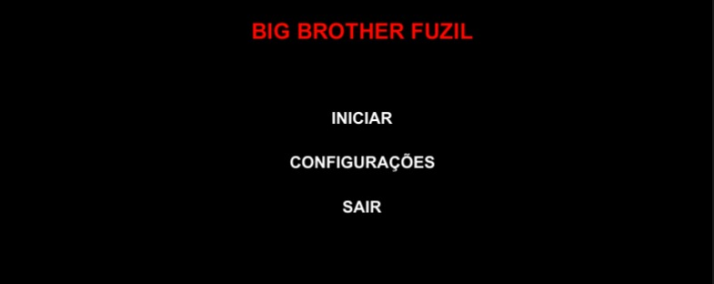
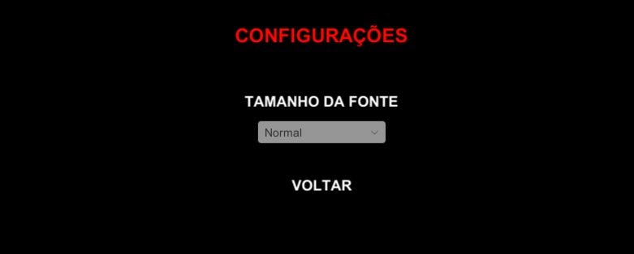
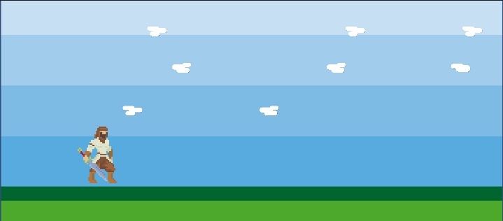

# BIG BROTHER FUZIL

## Grupo 
* João Victor Rodrigues
* Pedro Henrique Chaves
* Rafael Martins
* Vitória de Souza 

## O que é?

O Big Brother Fuzil (nome provisório) é um jogo de luta e tiro numa plataforma 2D. Os personagens, representados por personagens icônicos da mídia, serão escolhidos pelo jogador, sendo o objetivo do jogo acabar com as vidas do adversário. A dinâmica do jogo será baseada tanto em jogos de plataforma como Megamen quanto em jogos de "Melee Combat", como Street Fighter.

## Menu

## Configurações

## Primeira cena do jogo

* A cena atual, feita com base em tutorial disponibilizado na sala da disciplina no Google Clasroom e em playlist instrucional do canal do YouTube "Brackeys", é apenas um modelo teste. Os cenários definitivos, bem como os personagens jogáveis, serão implementadas posteriormente. No estágio atual, é possivel movimentar o jogador na horizontal e pular com esse.

## Acessibilidade do Jogo
* Tamanho da fonte;
* Uso de fonte não serifada; 
* Descrição em áudio das opções do menu e dos acontecimentos do jogo;
* Opções diferentes de cores

### Observação
* Pretende-se adicionar modos de jogo para os diferentes tipos de daltonismo e navegação por teclas;
